# Maven Repository 생성하기. 

일반적으로 개발회사에서는 공통 라이브러리를 생성하고, 이를 이용할 수 있도록 소스를 아카이빙 하고, 의존성 서버에 올려두고 이용합니다. 

이때 의존성 서버로 가장 잘 알려진 Nexus 가 있는 반면, 오픈소스로 이용할 수 있는 서비스가 있으며 아파치 Archiva 라는 오픈 소스가 있어 이를 소개합니다. 

참고로 이 아티클은 mac 에서 스탠드 얼론으로 설치하는 것을 기준으로 합니다 .

## Archiva 인스톨 하기. 

http://archiva.apache.org/download.cgi 에 접속하여 파일을 다운로드 받습니다. 

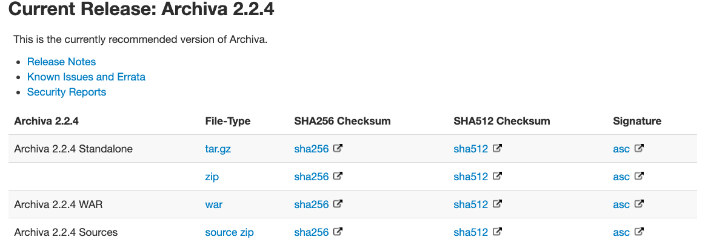

위 화면에서 Archiva 2.2.4 Standalone 를 다운로드 받습니다.

HA 구성이 필요하다면 Archiva 2.2.4 WAR 를 다운로드 받고, 서버에 HA 를 구성하여 안정성을 강화 하면 됩니다. 

## 다운로드된 소스 압축 풀기 

Archiva 는 기본적으로 jdk 1.8 을 지원합니다. 13 버젼은 테스트 해봤으나 의존성 라이브러리가 맞지 않아 실행이 되지 않으니 주의가 필요합니다. 

<설치폴더>/apache-archiva-2.2.4/bin 디렉토리 아래 archiva 파일이 실행 파일입니다 .

```$xslt
# cd <설치폴더>/apache-archiva-2.2.4/bin
# archiva console
```

위 명령어를 이용하여 실행할 수 있습니다. 

### 보한 허용하기. 

mac 에서는 알수없는 곳에서 다운로드 한 파일이라고 실행이 안될때가 있습니다. 

이때에는 다음과 같이 보안탭에서 허용을 해주면 됩니다. 

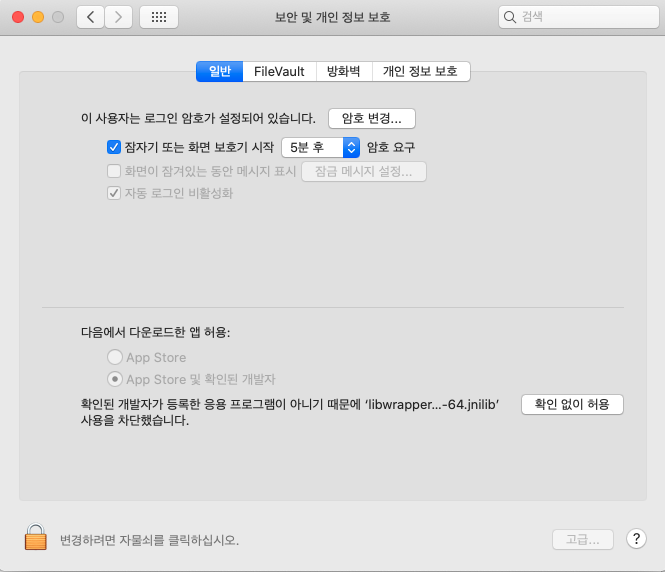 

"확인 없이 허용" 를 클릭 해줍니다. 

## Archiva 콘솔 이용하기. 

http://localhost:8080 으로 접근합니다. 

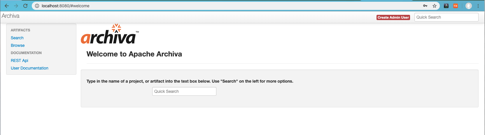

처음 접근하면 Admin 유저를 생성해야합니다. 

우 상단의 Create Admin User 버튼을 클릭하여 어드민 사용자를 생성해주세요. 

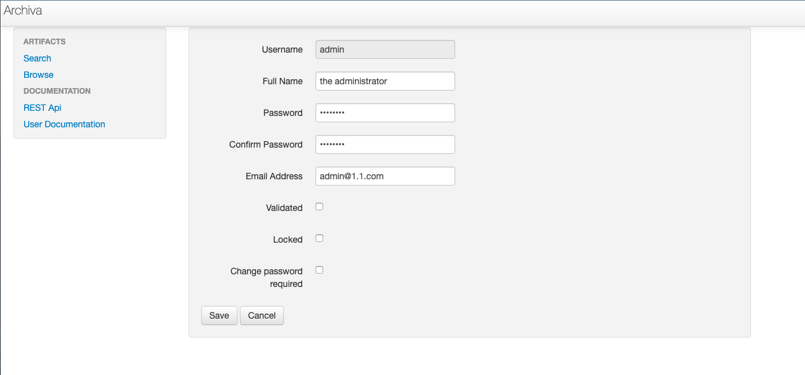

이렇게 생성해주면 메인 화면으로 다음과 같이 이동합니다. 

## 사용자 생성하기 

USERS > Manage 메뉴로 들어와서 테스트 사용자를 생성해 보겠습니다. 

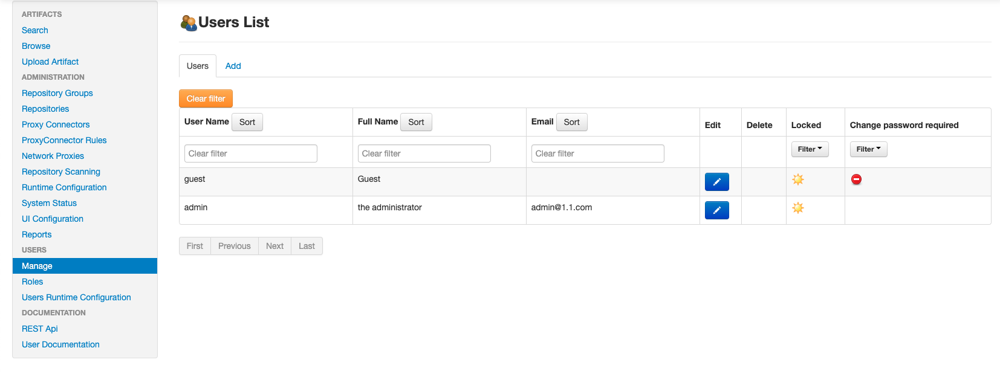

Add 탭을 클릭하여 사용자를 생성해줍니다. 

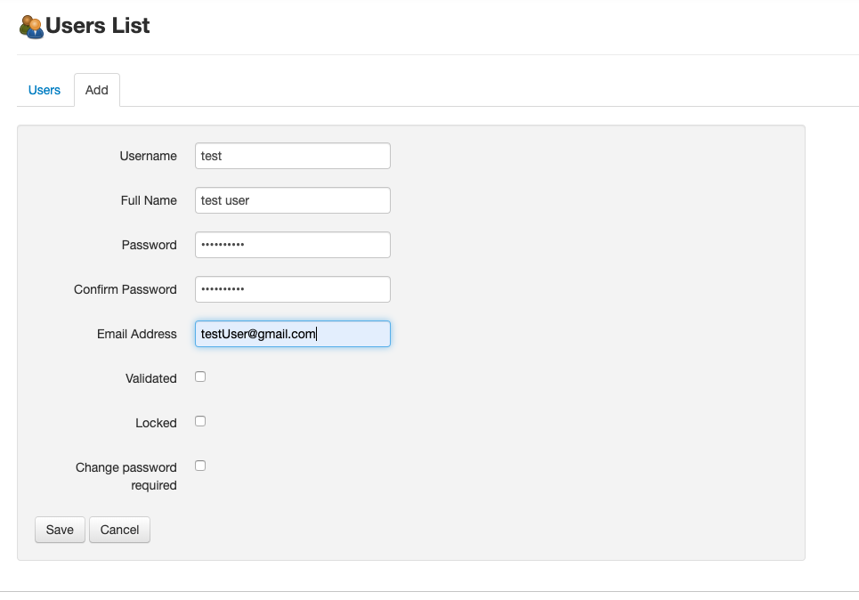

위와 같은 사용자 정보를 기술하고 "save" 버튼으로 생성합니다.

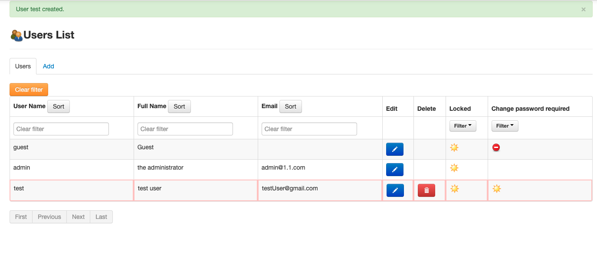 

위와 같이 test 사용자가 생성되었습니다. 

## 권한 부여하기. 

USERS > Roles 메뉴를 선택합니다. 

권한에 대한 상세한 설명은 https://archiva.apache.org/docs/1.4-M4/adminguide/roles.html 을 참조하세요. 

우리는 테스트 사용자가 아티팩트를 업로드 할 수 있게 하기 위해서 Global Repository Manager 로 부여하도록 하겠습니다. 

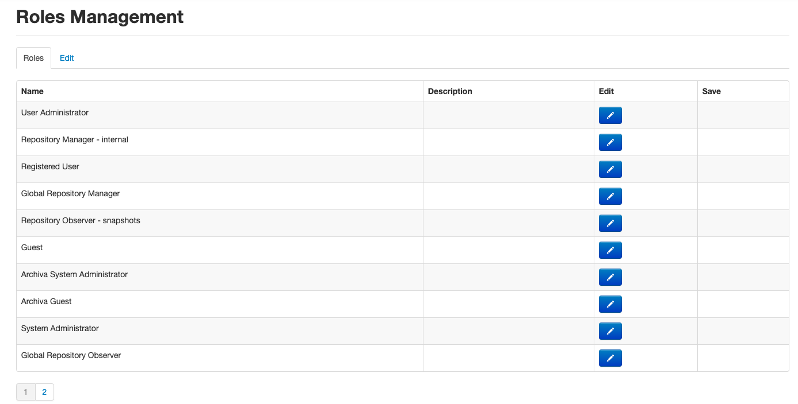

메뉴에서 Global Repository Manager 를 찾아서 편집 버튼을 클릭합니다. 

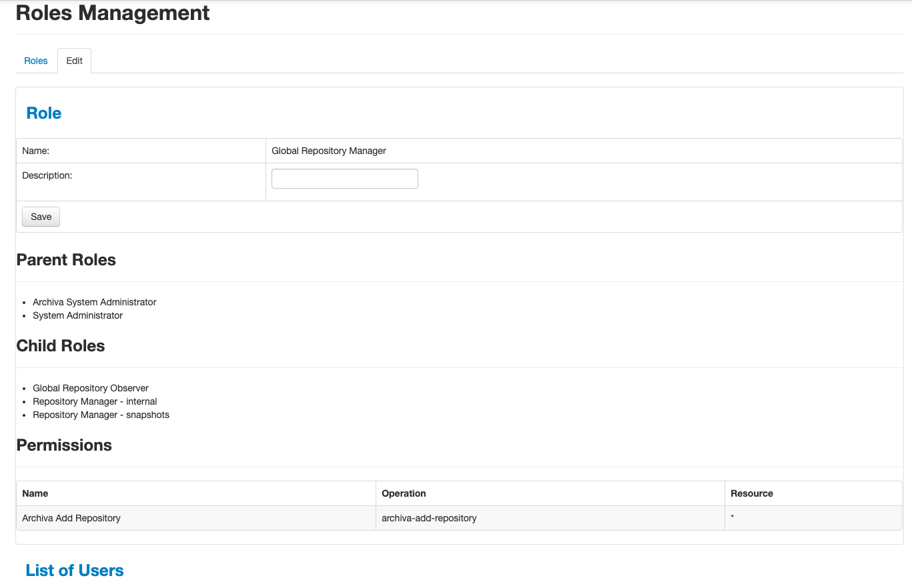

클릭하면 롤에 대한 상세 항목이 노출됩니다. 

아래 List of Users 를 클릭하빈다. 

그리고 Add 탭을 클릭합니다. 

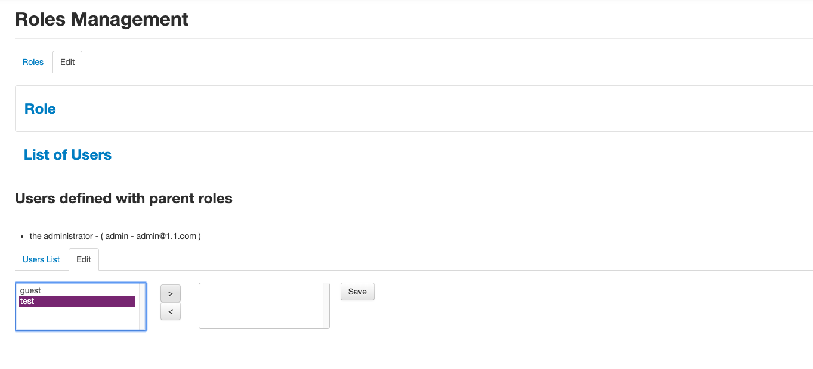

사용자가 나타나면, test 를 클릭하고 > 버튼을 클릭하여 롤에 추가합니다. 

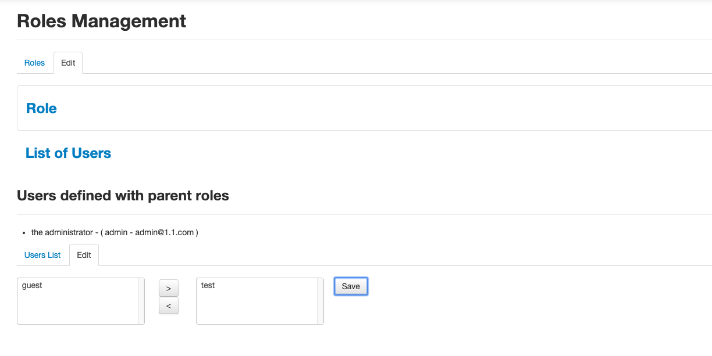

"Save" 버튼으로 등록 완료합니다. 

## 프로젝트에서 pom.xml 파일 수정하기. 

이제 업로드를 하기 위해서 아래 의존성 기능을 추가합니다. 

```$xslt
	<build>
		... 생
		<extensions>
			<extension>
				<groupId>org.apache.maven.wagon</groupId>
				<artifactId>wagon-webdav-jackrabbit</artifactId>
				<version>2.2</version>
			</extension>
		</extensions>
	</build>

```

```$xslt
	<distributionManagement>
		<repository>
			<id>archiva.internal</id>
			<name>Internal Release Repository</name>
			<url>http://localhost:8080/repository/internal/</url>
		</repository>
		<snapshotRepository>
			<id>archiva.snapshots</id>
			<name>Internal Snapshot Repository</name>
			<url>http://localhost:8080/repository/snapshots/</url>
		</snapshotRepository>
	</distributionManagement>
```

## Repository 등록을 위한 권한 설정해주기 

위와 같이 변경해 주었다면 이제는 업로드할 사용자를 setting.xml 에 등록해 주어야하빈다. 

우리는 IntelliJ 를 이용하기 때문에 아래 그림과 같이 setting.xml 파일을 오픈해 줍니다. 

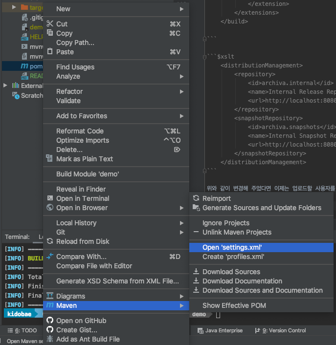

그리고 setting.xml 파일을 아래와 같이 수정해줍니다. 

```$xslt

<?xml version="1.0" encoding="UTF-8"?>
<settings xmlns="http://maven.apache.org/SETTINGS/1.0.0"
          xmlns:xsi="http://www.w3.org/2001/XMLSchema-instance"
          xsi:schemaLocation="http://maven.apache.org/SETTINGS/1.0.0 http://maven.apache.org/xsd/settings-1.0.0.xsd">
    <servers>
        <server>
            <id>archiva.internal</id>
            <username>test</username>
            <password>test123!@#</password>
        </server>
        <server>
            <id>archiva.snapshots</id>
            <username>test</username>
            <password>test123!@#</password>
        </server>
        <!-- omitted xml -->
    </servers>
</settings>
```

## 아티팩트 등록하기. 

이제 Maven Repository 에 아티팩트를 등록해주도록 하겠습니다. 

터미널을 오픈하고 다음 명령을 수행해줍니다. 

```$xslt
mvn deploy
```

그럼 아래와 같이 아티팩트 파일이 업로드 됩니다. 

```$xslt
mvn deploy
[INFO] Scanning for projects...
[INFO] 
[INFO] ------------------------------------------------------------------------
[INFO] Building demo 0.0.1-SNAPSHOT
[INFO] ------------------------------------------------------------------------
[INFO] 
[INFO] --- maven-resources-plugin:3.1.0:resources (default-resources) @ demo ---
[INFO] Using 'UTF-8' encoding to copy filtered resources.
[INFO] Copying 1 resource
[INFO] Copying 0 resource
[INFO] 
[INFO] --- maven-compiler-plugin:3.8.1:compile (default-compile) @ demo ---
[INFO] Nothing to compile - all classes are up to date
[INFO] 
[INFO] --- maven-resources-plugin:3.1.0:testResources (default-testResources) @ demo ---
[INFO] Using 'UTF-8' encoding to copy filtered resources.
[INFO] skip non existing resourceDirectory /Users/kidobae/Documents/60.SAMPLE_JAVA/demo/src/test/resources
[INFO] 
[INFO] --- maven-compiler-plugin:3.8.1:testCompile (default-testCompile) @ demo ---
[INFO] Nothing to compile - all classes are up to date
[INFO] 
[INFO] --- maven-surefire-plugin:2.22.2:test (default-test) @ demo ---
[INFO] 
[INFO] -------------------------------------------------------
[INFO]  T E S T S
[INFO] -------------------------------------------------------
[INFO] Running com.template.coe.demo.DemoApplicationTests
15:56:37.439 [main] DEBUG org.springframework.test.context.BootstrapUtils - Instantiating CacheAwareContextLoaderDelegate from class [org.springframework.test.context.cache.DefaultCacheAwareContextLoaderDelegate]
15:56:37.461 [main] DEBUG org.springframework.test.context.BootstrapUtils - Instantiating BootstrapContext using constructor [public org.springframework.test.context.support.DefaultBootstrapContext(java.lang.Class,org.springframework.test.context.CacheAwareContextLoaderDelegate)]
15:56:37.507 [main] DEBUG org.springframework.test.context.BootstrapUtils - Instantiating TestContextBootstrapper for test class [com.template.coe.demo.DemoApplicationTests] from class [org.springframework.boot.test.context.SpringBootTestContextBootstrapper]
15:56:37.551 [main] INFO org.springframework.boot.test.context.SpringBootTestContextBootstrapper - Neither @ContextConfiguration nor @ContextHierarchy found for test class [com.template.coe.demo.DemoApplicationTests], using SpringBootContextLoader
15:56:37.557 [main] DEBUG org.springframework.test.context.support.AbstractContextLoader - Did not detect default resource location for test class [com.template.coe.demo.DemoApplicationTests]: class path resource [com/template/coe/demo/DemoApplicationTests-context.xml] does not exist
15:56:37.558 [main] DEBUG org.springframework.test.context.support.AbstractContextLoader - Did not detect default resource location for test class [com.template.coe.demo.DemoApplicationTests]: class path resource [com/template/coe/demo/DemoApplicationTestsContext.groovy] does not exist
15:56:37.558 [main] INFO org.springframework.test.context.support.AbstractContextLoader - Could not detect default resource locations for test class [com.template.coe.demo.DemoApplicationTests]: no resource found for suffixes {-context.xml, Context.groovy}.
15:56:37.559 [main] INFO org.springframework.test.context.support.AnnotationConfigContextLoaderUtils - Could not detect default configuration classes for test class [com.template.coe.demo.DemoApplicationTests]: DemoApplicationTests does not declare any static, non-private, non-final, nested classes annotated with @Configuration.
15:56:37.615 [main] DEBUG org.springframework.test.context.support.ActiveProfilesUtils - Could not find an 'annotation declaring class' for annotation type [org.springframework.test.context.ActiveProfiles] and class [com.template.coe.demo.DemoApplicationTests]
15:56:37.736 [main] DEBUG org.springframework.context.annotation.ClassPathScanningCandidateComponentProvider - Identified candidate component class: file [/Users/kidobae/Documents/60.SAMPLE_JAVA/demo/target/classes/com/template/coe/demo/DemoApplication.class]
15:56:37.738 [main] INFO org.springframework.boot.test.context.SpringBootTestContextBootstrapper - Found @SpringBootConfiguration com.template.coe.demo.DemoApplication for test class com.template.coe.demo.DemoApplicationTests
15:56:37.889 [main] DEBUG org.springframework.boot.test.context.SpringBootTestContextBootstrapper - @TestExecutionListeners is not present for class [com.template.coe.demo.DemoApplicationTests]: using defaults.
15:56:37.890 [main] INFO org.springframework.boot.test.context.SpringBootTestContextBootstrapper - Loaded default TestExecutionListener class names from location [META-INF/spring.factories]: [org.springframework.boot.test.mock.mockito.MockitoTestExecutionListener, org.springframework.boot.test.mock.mockito.ResetMocksTestExecutionListener, org.springframework.boot.test.autoconfigure.restdocs.RestDocsTestExecutionListener, org.springframework.boot.test.autoconfigure.web.client.MockRestServiceServerResetTestExecutionListener, org.springframework.boot.test.autoconfigure.web.servlet.MockMvcPrintOnlyOnFailureTestExecutionListener, org.springframework.boot.test.autoconfigure.web.servlet.WebDriverTestExecutionListener, org.springframework.test.context.web.ServletTestExecutionListener, org.springframework.test.context.support.DirtiesContextBeforeModesTestExecutionListener, org.springframework.test.context.support.DependencyInjectionTestExecutionListener, org.springframework.test.context.support.DirtiesContextTestExecutionListener, org.springframework.test.context.transaction.TransactionalTestExecutionListener, org.springframework.test.context.jdbc.SqlScriptsTestExecutionListener, org.springframework.test.context.event.EventPublishingTestExecutionListener]
15:56:37.904 [main] DEBUG org.springframework.boot.test.context.SpringBootTestContextBootstrapper - Skipping candidate TestExecutionListener [org.springframework.test.context.transaction.TransactionalTestExecutionListener] due to a missing dependency. Specify custom listener classes or make the default listener classes and their required dependencies available. Offending class: [org/springframework/transaction/interceptor/TransactionAttributeSource]
15:56:37.905 [main] DEBUG org.springframework.boot.test.context.SpringBootTestContextBootstrapper - Skipping candidate TestExecutionListener [org.springframework.test.context.jdbc.SqlScriptsTestExecutionListener] due to a missing dependency. Specify custom listener classes or make the default listener classes and their required dependencies available. Offending class: [org/springframework/transaction/interceptor/TransactionAttribute]
15:56:37.905 [main] INFO org.springframework.boot.test.context.SpringBootTestContextBootstrapper - Using TestExecutionListeners: [org.springframework.test.context.web.ServletTestExecutionListener@2f217633, org.springframework.test.context.support.DirtiesContextBeforeModesTestExecutionListener@a530d0a, org.springframework.boot.test.mock.mockito.MockitoTestExecutionListener@1a18644, org.springframework.boot.test.autoconfigure.SpringBootDependencyInjectionTestExecutionListener@5acf93bb, org.springframework.test.context.support.DirtiesContextTestExecutionListener@7e7be63f, org.springframework.test.context.event.EventPublishingTestExecutionListener@6cd28fa7, org.springframework.boot.test.mock.mockito.ResetMocksTestExecutionListener@614ca7df, org.springframework.boot.test.autoconfigure.restdocs.RestDocsTestExecutionListener@4738a206, org.springframework.boot.test.autoconfigure.web.client.MockRestServiceServerResetTestExecutionListener@66d3eec0, org.springframework.boot.test.autoconfigure.web.servlet.MockMvcPrintOnlyOnFailureTestExecutionListener@1e04fa0a, org.springframework.boot.test.autoconfigure.web.servlet.WebDriverTestExecutionListener@1af2d44a]
15:56:37.910 [main] DEBUG org.springframework.test.context.support.AbstractDirtiesContextTestExecutionListener - Before test class: context [DefaultTestContext@52af26ee testClass = DemoApplicationTests, testInstance = [null], testMethod = [null], testException = [null], mergedContextConfiguration = [WebMergedContextConfiguration@6fd83fc1 testClass = DemoApplicationTests, locations = '{}', classes = '{class com.template.coe.demo.DemoApplication}', contextInitializerClasses = '[]', activeProfiles = '{}', propertySourceLocations = '{}', propertySourceProperties = '{org.springframework.boot.test.context.SpringBootTestContextBootstrapper=true}', contextCustomizers = set[org.springframework.boot.test.context.filter.ExcludeFilterContextCustomizer@59d016c9, org.springframework.boot.test.json.DuplicateJsonObjectContextCustomizerFactory$DuplicateJsonObjectContextCustomizer@3967e60c, org.springframework.boot.test.mock.mockito.MockitoContextCustomizer@0, org.springframework.boot.test.web.client.TestRestTemplateContextCustomizer@5be6e01c, org.springframework.boot.test.autoconfigure.properties.PropertyMappingContextCustomizer@0, org.springframework.boot.test.autoconfigure.web.servlet.WebDriverContextCustomizerFactory$Customizer@63021689], resourceBasePath = 'src/main/webapp', contextLoader = 'org.springframework.boot.test.context.SpringBootContextLoader', parent = [null]], attributes = map['org.springframework.test.context.web.ServletTestExecutionListener.activateListener' -> true]], class annotated with @DirtiesContext [false] with mode [null].
15:56:37.948 [main] DEBUG org.springframework.test.context.support.TestPropertySourceUtils - Adding inlined properties to environment: {spring.jmx.enabled=false, org.springframework.boot.test.context.SpringBootTestContextBootstrapper=true, server.port=-1}

  .   ____          _            __ _ _
 /\\ / ___'_ __ _ _(_)_ __  __ _ \ \ \ \
( ( )\___ | '_ | '_| | '_ \/ _` | \ \ \ \
 \\/  ___)| |_)| | | | | || (_| |  ) ) ) )
  '  |____| .__|_| |_|_| |_\__, | / / / /
 =========|_|==============|___/=/_/_/_/
 :: Spring Boot ::        (v2.2.2.RELEASE)

2020-01-16 15:56:38.267  INFO 17904 --- [           main] c.t.coe.demo.DemoApplicationTests        : Starting DemoApplicationTests on C02VH1T8HTD5 with PID 17904 (started by kidobae in /Users/kidobae/Documents/60.SAMPLE_JAVA/demo)
2020-01-16 15:56:38.268  INFO 17904 --- [           main] c.t.coe.demo.DemoApplicationTests        : No active profile set, falling back to default profiles: default
2020-01-16 15:56:39.700  INFO 17904 --- [           main] o.s.s.concurrent.ThreadPoolTaskExecutor  : Initializing ExecutorService 'applicationTaskExecutor'
2020-01-16 15:56:40.038  INFO 17904 --- [           main] c.t.coe.demo.DemoApplicationTests        : Started DemoApplicationTests in 2.076 seconds (JVM running for 3.353)
[INFO] Tests run: 1, Failures: 0, Errors: 0, Skipped: 0, Time elapsed: 2.944 s - in com.template.coe.demo.DemoApplicationTests
2020-01-16 15:56:40.390  INFO 17904 --- [extShutdownHook] o.s.s.concurrent.ThreadPoolTaskExecutor  : Shutting down ExecutorService 'applicationTaskExecutor'
[INFO] 
[INFO] Results:
[INFO] 
[INFO] Tests run: 1, Failures: 0, Errors: 0, Skipped: 0
[INFO] 
[INFO] 
[INFO] --- maven-jar-plugin:3.1.2:jar (default-jar) @ demo ---
[INFO] Building jar: /Users/kidobae/Documents/60.SAMPLE_JAVA/demo/target/demo-0.0.1-SNAPSHOT.jar
[INFO] 
[INFO] --- spring-boot-maven-plugin:2.2.2.RELEASE:repackage (repackage) @ demo ---
[INFO] Replacing main artifact with repackaged archive
[INFO] 
[INFO] --- maven-install-plugin:2.5.2:install (default-install) @ demo ---
[INFO] Installing /Users/kidobae/Documents/60.SAMPLE_JAVA/demo/target/demo-0.0.1-SNAPSHOT.jar to /Users/kidobae/.m2/repository/com/template/coe/demo/0.0.1-SNAPSHOT/demo-0.0.1-SNAPSHOT.jar
[INFO] Installing /Users/kidobae/Documents/60.SAMPLE_JAVA/demo/pom.xml to /Users/kidobae/.m2/repository/com/template/coe/demo/0.0.1-SNAPSHOT/demo-0.0.1-SNAPSHOT.pom
[INFO] 
[INFO] --- maven-deploy-plugin:2.8.2:deploy (default-deploy) @ demo ---
Downloading from archiva.snapshots: http://localhost:8080/repository/snapshots/com/template/coe/demo/0.0.1-SNAPSHOT/maven-metadata.xml
Downloaded from archiva.snapshots: http://localhost:8080/repository/snapshots/com/template/coe/demo/0.0.1-SNAPSHOT/maven-metadata.xml (770 B at 7.8 kB/s)
Uploading to archiva.snapshots: http://localhost:8080/repository/snapshots/com/template/coe/demo/0.0.1-SNAPSHOT/demo-0.0.1-20200116.065642-2.jar
Uploaded to archiva.snapshots: http://localhost:8080/repository/snapshots/com/template/coe/demo/0.0.1-SNAPSHOT/demo-0.0.1-20200116.065642-2.jar (19 MB at 29 MB/s)
Uploading to archiva.snapshots: http://localhost:8080/repository/snapshots/com/template/coe/demo/0.0.1-SNAPSHOT/demo-0.0.1-20200116.065642-2.pom
Uploaded to archiva.snapshots: http://localhost:8080/repository/snapshots/com/template/coe/demo/0.0.1-SNAPSHOT/demo-0.0.1-20200116.065642-2.pom (2.1 kB at 66 kB/s)
Downloading from archiva.snapshots: http://localhost:8080/repository/snapshots/com/template/coe/demo/maven-metadata.xml
Downloaded from archiva.snapshots: http://localhost:8080/repository/snapshots/com/template/coe/demo/maven-metadata.xml (317 B at 32 kB/s)
Uploading to archiva.snapshots: http://localhost:8080/repository/snapshots/com/template/coe/demo/0.0.1-SNAPSHOT/maven-metadata.xml
Uploaded to archiva.snapshots: http://localhost:8080/repository/snapshots/com/template/coe/demo/0.0.1-SNAPSHOT/maven-metadata.xml (770 B at 77 kB/s)
Uploading to archiva.snapshots: http://localhost:8080/repository/snapshots/com/template/coe/demo/maven-metadata.xml
Uploaded to archiva.snapshots: http://localhost:8080/repository/snapshots/com/template/coe/demo/maven-metadata.xml (316 B at 29 kB/s)
[INFO] ------------------------------------------------------------------------
[INFO] BUILD SUCCESS
[INFO] ------------------------------------------------------------------------
[INFO] Total time: 8.356 s
[INFO] Finished at: 2020-01-16T15:56:42+09:00
[INFO] Final Memory: 31M/320M
[INFO] ------------------------------------------------------------------------

```
 
 ## 아티팩트 확인하기. 
 
 이제 업로드된 아티팩트를 확인해볼 차례입니다. 
 
 Archiva 콘솔에서 ARTIFACTS > Search 를 열어 확인해보겠습니다.
 
 우리의 artifact 이름이 demo 이므로 demo 로 검색합니다. 
 
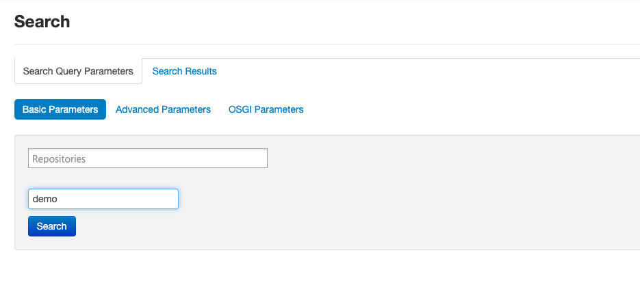

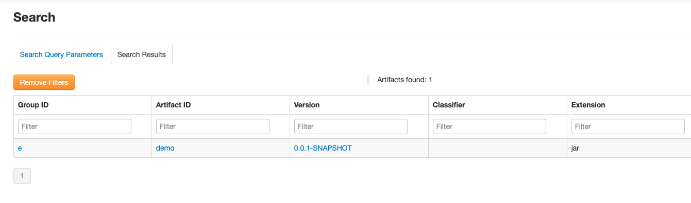

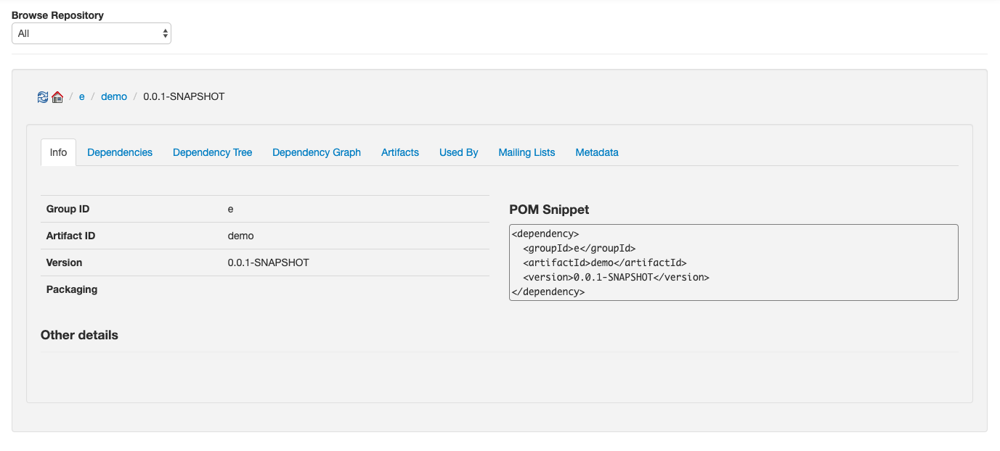
 
정상적으로 등록 되었음을 확인하였습니다. 

# 결론

라이브러리를 생성하고, 기업내 private 라이브러리를 사용하기 위해서 Maven Repository Server 사용은 필수입니다. 

이때 Archiva 오픈 소스를 고려해 보는 것도 도움이 될것 같습니다. 
 