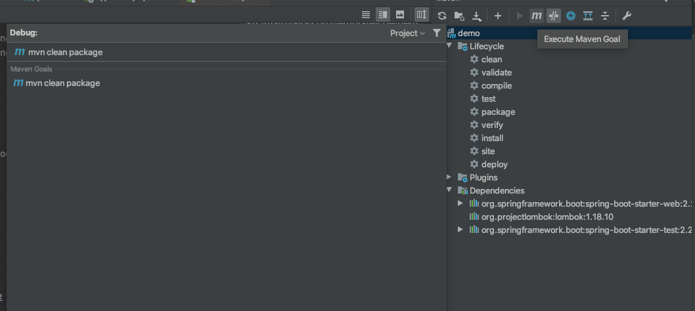
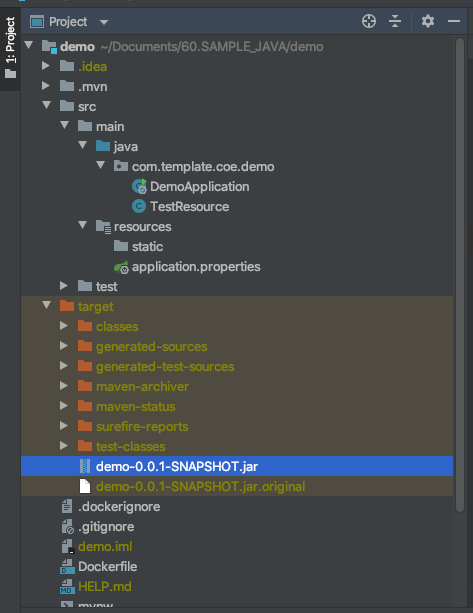

# Dockerize Spring

최근 Kube 등 오케스트레이션 도구들이 개발진영에 쫙 깔리면서, 이를 위한 컨테이너로 Docker 은 사실상 베이스 컨테이너 도구가 되었습니다. 

스프링 부트 프로젝트에서 도커를 이용하여 컨테이너화 하는 작업을 해보도록 하겠습니다. 

## spring packing

일단 스프링 프레임워크를 이용하여 간단한 웹 페이지를 하나 만듭니다. 

### 의존성 확인하기. 

저의 경우 Maven 을 이용하였고 의존성은 다음과 같이 설정하였습니다. 

```$xslt
	<properties>
		<java.version>1.8</java.version>
	</properties>

	<dependencies>
		<dependency>
			<groupId>org.springframework.boot</groupId>
			<artifactId>spring-boot-starter-web</artifactId>
		</dependency>

		<dependency>
			<groupId>org.projectlombok</groupId>
			<artifactId>lombok</artifactId>
			<optional>true</optional>
		</dependency>
		<dependency>
			<groupId>org.springframework.boot</groupId>
			<artifactId>spring-boot-starter-test</artifactId>
			<scope>test</scope>
			<exclusions>
				<exclusion>
					<groupId>org.junit.vintage</groupId>
					<artifactId>junit-vintage-engine</artifactId>
				</exclusion>
			</exclusions>
		</dependency>
	</dependencies>

	<build>
		<plugins>
			<plugin>
				<groupId>org.springframework.boot</groupId>
				<artifactId>spring-boot-maven-plugin</artifactId>
			</plugin>
		</plugins>
	</build>
```

딱봐도 전형적인 스프링 부트 웹 프로젝트입니다. 

```$xslt
		<dependency>
			<groupId>org.springframework.boot</groupId>
			<artifactId>spring-boot-starter-web</artifactId>
		</dependency>
```

이것으로 Rest API 를 만들 준비가 되었습니다. 

참고로 java-compiler 버젼은 1.8을 이용했습니다. 

```$xslt
	<properties>
		<java.version>1.8</java.version>
	</properties>
```

## Test용 RestController 만들기. 

REST API 를 만들것이기 때문에 src/main/java/com/template/coe/demo/TestResource.java 파일을 다음과 같이 만들었습니다 .

```$xslt
package com.template.coe.demo;

import org.springframework.web.bind.annotation.GetMapping;
import org.springframework.web.bind.annotation.RestController;

@RestController
public class TestResource {

    @GetMapping("/api/greeting")
    public String greeting() {
        return "Hello I'm Spring and Docker";
    }
}

```

정말 간단한 인사하는 프로그램...

## 패키지 빌드하기. 

가장 먼저 할 것은 spring boot 을 fat jar 로 만드는 것입니다. 



그러기 위해서 아래와 같이 패키징을 수행하였습니다.  

```$xslt
mvn clean package
```

수행하고나면 jar 파일이 다음과 같은 경로에 생성이 됩니다. 



이제 이 jar 파일을 이용할 것입니다. 

## .dockerignore 를 이용하여 필요한 파일만 도커라이징 하기. 

도커라이징을 하기 위해서는 .dockerignore 파일에 필요없는 파일들을 제외하라고 기술합니다. 

다음과 같이 기술해 주시면 좋습니다. 

```$xslt
.*
target/*
!target/demo-*.jar
```

위 내용을 해석해보면 

- `.*` 으로 모든파일을 제외하라.
- `target/*` 으로 target 디렉토리 하위에 모든 파일을 제거하자. 
- `!target/demo-*.jar` 으로 demo-*.jar 파일만 예외 처리하자라는 의미로 ! 가 사용되었습니다. 
  
## Dockerfile 컨테이너 생성 스크립트 작성하기. 

이제 Docker 컨테이너를 만들 차례 입니다. 

루트 디렉토리에서 Dockerfile 을 생성하고, 다음과 같이 기술해 줍니다. 

```$xslt
FROM openjdk:8-jdk-alpine

RUN mkdir -p /app

ADD target/demo-0.0.1-SNAPSHOT.jar /app/app.jar

EXPOSE 8080

ENTRYPOINT ["/usr/bin/java", "-jar", "/app/app.jar", "--spring.profiles.active=docker"]
```

```$xslt
FROM openjdk:8-jdk-alpine
```

이 의미는 컨테이너의 기본 이미지를 가져옵니다. 즉 도커파일이 실행할때 가장 기본이 되는 운영환경입니다. 

```$xslt
RUN mkdir -p /app

```

을 통해서 우리 어플리케이션이 위치할 디렉토리를 만듭니다. /app 라는 디렉토리를 만들었습니다. 

```$xslt
ADD target/demo-0.0.1-SNAPSHOT.jar /app/app.jar
```

이제 target/demo-0.0.1-SNAPSHOT.jar 파일(이것은 우리 로컬 파일 경로입니다.)을 /app/app.jar 으로 복사항니다. (이 경로는 Docker Container 내부의 경로입니다.)

```$xslt
EXPOSE 8080

``` 

이 명령은 우리가 만든 어플리케이션을 외부로 노출시킬때 어떠한 포트로 노출할 것인지를 설정합니다. 

이렇게 되면 Docker container 가 8080 외부와 통신하도록 열어준다는 의미입니다. 

```$xslt
ENTRYPOINT ["/usr/bin/java", "-jar", "/app/app.jar", "--spring.profiles.active=docker"]

```

ENTRYPOINT 는 위 명령어가 모두 실행되고 나서 Docker container 가 실행할 명령어 이며, docker run 을 수행하면, 자동으로 실행되는 것이라 엔트리포인트라고 합니다. 

위 내용은 /usr/bin/java -jar /app/app.jar --spring.profiles.active=docker 로 커맨드를 만들어 실행합니다. 

## build Docker 로 도커 빌딩 하기

이제 Dockerfile 스크립트를 만들었으니, 이제 컨테이너를 실제로 만들 차례입니다. 

```$xslt
docker build -t unclebae/demo-api .
```

-t 옵션은 컨테이너 파일의 이름입니다. 

중요한 것은 마지막에 `.` 입니다. 이거 꼭 붙여줘야합니다. 왜냐하면 도커파일이 어디 있는지 알려주고, 실제 파일의 경로를 찾아가는 베이스 디렉토리를 알려주는 것입니다. 

```$xslt
$docker build -t unclebae/demo-api .

Sending build context to Docker daemon  19.55MB
Step 1/5 : FROM openjdk:8-jdk-alpine
 ---> 04060a9dfc39
Step 2/5 : RUN mkdir -p /app
 ---> Using cache
 ---> a97fccaeccbd
Step 3/5 : ADD target/demo-0.0.1-SNAPSHOT.jar /app/app.jar
 ---> 66ba49f46afb
Step 4/5 : EXPOSE 8080
 ---> Running in 489c66bf4170
Removing intermediate container 489c66bf4170
 ---> de0ee050fbcf
Step 5/5 : ENTRYPOINT ["/usr/bin/java", "-jar", "/app/app.jar", "--spring.profiles.active=docker"]
 ---> Running in 8ab53f5632db
Removing intermediate container 8ab53f5632db
 ---> 4a9fbebe759c
Successfully built 4a9fbebe759c
Successfully tagged unclebae/demo-api:latest

```

위와같이 docker 컨테이너가 생성되었습니다. 

확인해볼까요? 

```$xslt
$docker images

REPOSITORY                                TAG                  IMAGE ID            CREATED              SIZE
unclebae/demo-api                         latest               4a9fbebe759c        About a minute ago   122MB

```

생성한 이미지들이 나열됩니다. 

## run docker 로 실행하기. 

```$xslt
$docker run -d -p 8888:8080 unclebae/demo-api

37fc052368b1795603f21e463113dd4467792c18feb3daff32a0a1e6c1889cab
```

위와 같이 실행되었습니다. 

-d 옵션은 detatch 의 의미로, 백그라운드로 실행한다는 의미입니다. 

-p 옵션은 docker 가 외부에서 들어오는 바인딩 포트를 8888 로 지정하고, 내부에 이전 스크립트에서 지정한 EXPOSE 8080 으로 바인딩 해준다는 의미입니다. 

이렇게 바인딩하면 우리는 http://localhost:8888 로 접근하는경우 컨테이너의 8080 포트 어플리케이션에 요청을 보내고 응답을 받는다는 의미입니다. 

## test 해보기 

이제 Docker 로 실행결과를 확인해볼차례입니다. 

http://localhost:8888/api/greeting

```$xslt
$curl -i http://localhost:8888/api/greeting

HTTP/1.1 200 
Content-Type: text/plain;charset=UTF-8
Content-Length: 27
Date: Fri, 21 Feb 2020 00:17:41 GMT

Hello I'm Spring and Docker
```

정상적으로 결과를 확인했습니다. 

## 여러개 인스턴스 띄우기. 

```$xslt
$docker run -d -p 8889:8080 unclebae/demo-api
07d8482bd39d126abd7edff563971fcbeb239073267cefa85b5d3c75ea3f02df

$docker run -d -p 8890:8080 unclebae/demo-api
917ae890fb54dce22beb60e9c8020da6a9714041f0274632ec7aff074ad59194

```

```$xslt
$docker ps

CONTAINER ID        IMAGE               COMMAND                  CREATED             STATUS              PORTS                    NAMES
917ae890fb54        unclebae/demo-api   "/usr/bin/java -jar …"   29 seconds ago      Up 28 seconds       0.0.0.0:8890->8080/tcp   festive_blackwell
07d8482bd39d        unclebae/demo-api   "/usr/bin/java -jar …"   34 seconds ago      Up 33 seconds       0.0.0.0:8889->8080/tcp   gracious_babbage
37fc052368b1        unclebae/demo-api   "/usr/bin/java -jar …"   5 minutes ago       Up 5 minutes        0.0.0.0:8888->8080/tcp   pedantic_joliot

```

이렇게 하면 아래와 같이 하나의 머신에 3개의 인스턴스가 떠서 서비스를 할 수 있습니다.  

```$xslt
$curl -i http://localhost:8888/api/greeting
$curl -i http://localhost:8889/api/greeting
$curl -i http://localhost:8890/api/greeting

```


## 결론. 

스프링을 도커로 작성해 보았습니다. 

.dockerignore 파일을 이용해서 필요없는 파일을 제거해서 docker 파일을 경량화 했습니다. 

그리고 Docker 파일 작성도 했고, 빌드와 실행도 해 보았습니다.

참 쉽죠잉~~~ ? ^^ 
